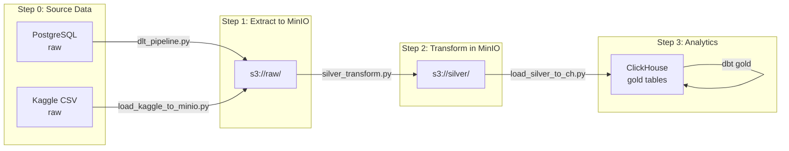
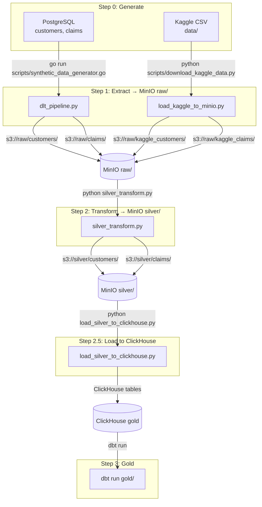
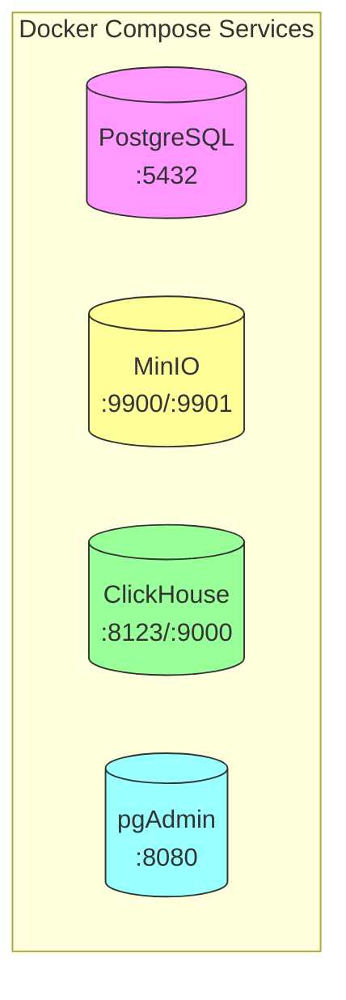
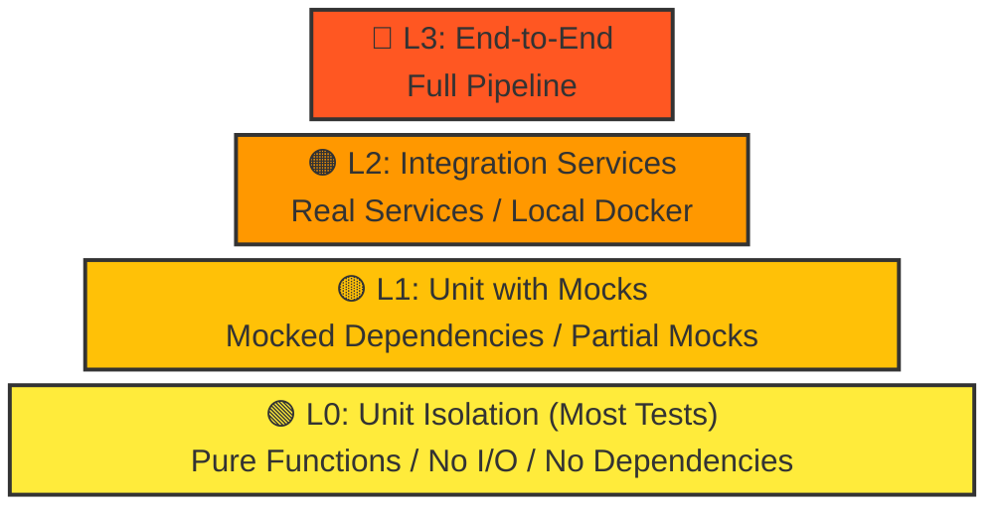

# Insurance Company Data Pipeline

A production-grade data lakehouse pipeline demonstrating modern ELT/ETL architecture with insurance industry data.

<div align="center">

[](https://www.postgresql.org/)
[](https://min.io/)
[](https://clickhouse.com/)
[](https://www.getdbt.com/)
[](https://dlthub.com/)
[](https://www.python.org/)
[](https://go.dev/)
[](https://www.docker.com/)

</div>

---

## Table of Contents

1. [Technologies Explained](#1-technologies-explained)
   - [1.1 PostgreSQL](#11-postgresql)
   - [1.2 MinIO](#12-minio)
   - [1.3 ClickHouse](#13-clickhouse)
   - [1.4 DBT](#14-dbt-data-build-tool)
   - [1.5 DLT](#15-dlt-data-load-tool)
   - [1.6 Python](#16-python)
   - [1.7 Go](#17-go)
   - [1.8 Docker](#18-docker)
2. [Architecture Overview](#2-architecture-overview)
3. [Data Flow Diagram](#3-data-flow-diagram)
4. [Infrastructure Components](#4-infrastructure-components)
5. [Raw Data Schema](#5-raw-data-schema)
   - [5.1 PostgreSQL Raw Tables](#51-postgresql-raw-tables)
   - [5.2 Kaggle CSV Schema](#52-kaggle-csv-schema)
   - [5.3 Data Mapping](#53-data-mapping-postgresql--kaggle)
   - [5.4 Silver Layer Schema](#54-silver-layer-schema)
   - [5.5 Gold Layer Schema](#55-gold-layer-schema)
6. [Project Structure](#6-project-structure)
7. [Test Pyramid](#7-test-pyramid)
8. [Quick Start](#8-quick-start)
9. [Database Connections](#9-database-connections)
10. [Running Tests](#10-running-tests)
11. [SQL Examples](#11-sql-examples)
12. [Environment Variables](#12-environment-variables)
13. [Troubleshooting](#13-troubleshooting)
14. [License](#14-license)
15. [Author](#15-author)

---

```
Copyright (c) 2026 BugMentor (https://bugmentor.com)
Eng. Matías J. Magni | CEO @ BugMentor
```

---

## 1. Technologies Explained

This section explains all technologies used in the pipeline, designed for both junior and senior engineers.

### 1.1. PostgreSQL

**What is it?**  
PostgreSQL is a powerful, open-source **relational database system** known for reliability and feature richness.

**Why use it here?**  
PostgreSQL serves as the **raw source of truth** for customer and claims data. It's ideal for transactional data with:
- ACID compliance
- Complex queries with JOINs
- JSON support
- Strong typing

**Key Concepts for Juniors:**
- **Table**: Like a spreadsheet with rows (records) and columns (fields)
- **Primary Key**: Unique identifier for each row
- **Foreign Key**: Links two tables together
- **SQL**: Language to query/manipulate data

**Key Concepts for Seniors:**
- **MVCC**: Multi-Version Concurrency Control for concurrent reads/writes
- **Indexing**: B-tree indexes for fast lookups
- **Partitioning**: Split large tables for performance
- **Replication**: Master-slave for high availability

**Connection:**
```bash
# Connect via CLI
docker exec -it insurance_postgres psql -U insurance_user -d insurance_db

# Example query
SELECT COUNT(*) FROM customers;
```

---

### 1.2. MinIO

**What is it?**  
MinIO is an **S3-compatible object storage** (Amazon Simple Storage Service). Think of it as a file system that stores files (called "objects") in "buckets".

**Why use it here?**  
MinIO provides the **Data Lake** layer:
- **Cheap storage** for massive amounts of data
- **Parquet format** for columnar storage (efficient for analytics)
- **S3 compatibility** - industry standard API

**Key Concepts for Juniors:**
- **Bucket**: Like a top-level folder (e.g., "insurance-data")
- **Object**: A file with metadata (e.g., `customers/customers_001.parquet`)
- **Parquet**: Columnar file format - stores data by columns, not rows
- **Raw Layer**: Original data as extracted from PostgreSQL
- **Silver Layer**: Cleaned/transformed data

**Key Concepts for Seniors:**
- **Object Storage vs Block/File**: Objects are flat (no hierarchy), addressed by key
- **Columnar vs Row-based**: Parquet reads only needed columns (faster for analytics)
- **Compression**: Parquet encodes data efficiently (up to 70% smaller)
- **S3 API**: RESTful API for CRUD operations on objects

**Querying MinIO Data:**

```python
# Using Python with pyarrow and s3fs
import pyarrow.parquet as pq
import s3fs

# Connect to MinIO
s3 = s3fs.S3FileSystem(
    endpoint_url="http://localhost:9900",
    key="minioadmin",
    secret="minioadmin"
)

# Read Parquet file
table = pq.read_table("insurance-data/silver/customers/", filesystem=s3)
df = table.to_pandas()

# Or read specific file
table = pq.read_table("s3://insurance-data/raw/customers/customers_001.parquet", filesystem=s3)
```

```bash
# Using AWS CLI with MinIO
aws --endpoint-url=http://localhost:9900 s3 ls s3://insurance-data/

# Download a file
aws --endpoint-url=http://localhost:9900 s3 cp s3://insurance-data/raw/customers/customers_001.parquet ./customers.parquet

# List files in a folder
aws --endpoint-url=http://localhost:9900 s3 ls s3://insurance-data/silver/customers/
```

```python
# Using pandas directly with PyArrow
import pandas as pd
import pyarrow as pa
import pyarrow.fs as fs

# Create MinIO filesystem
minio_fs = fs.SubTreeFileSystem("insurance-data", fs.LocalFileSystem())

# Read Parquet
table = pa.parquet.read_table("silver/customers/", filesystem=minio_fs)
df = table.to_pandas()
```

---

### 1.3. ClickHouse

**What is it?**  
ClickHouse is a **column-oriented database management system** (DBMS) optimized for **OLAP** (Online Analytical Processing). It's incredibly fast for aggregations.

**Why use it here?**  
ClickHouse provides the **Analytics layer**:
- **Massively parallel processing** across many cores
- **Columnar storage** for analytical queries
- **Compression** reduces storage by 5-10x
- **SQL interface** familiar to all developers

**Key Concepts for Juniors:**
- **Table**: Collection of data (like PostgreSQL)
- **Materialized View**: Pre-computed query result (cached)
- **Partitioning**: Split data by key (e.g., by date) for speed
- **No schema prefix**: Tables are accessed directly (e.g., `SELECT * FROM customers`)

**Key Concepts for Seniors:**
- **Column-oriented**: Data stored by column, not row - ideal for aggregations
- **Vectorized execution**: Processes batches of rows (SIMD)
- **MergeTree**: ClickHouse's primary table engine (similar to Log Structured Merge trees)
- **Distributed processing**: Queries run in parallel across nodes

**Querying ClickHouse:**

```bash
# Via Docker
docker exec -it insurance_clickhouse clickhouse-client

# Or via HTTP
curl "http://localhost:8123/?query=SELECT+COUNT(*)+FROM+customers"
```

```sql
-- Example queries
SELECT COUNT(*) FROM customers;
SELECT claim_status, COUNT(*) FROM claims GROUP BY claim_status;
SELECT * FROM claims_by_status;
```

---

### 1.4. DBT (Data Build Tool)

**What is it?**  
DBT is a **transformation tool** that lets you transform data in your warehouse using SQL. It follows the **ELT** pattern (Extract, Load, Transform).

**Why use it here?**  
DBT handles the **Silver → Gold** transformation:
- **Version control** for SQL models
- **Jinja templating** for reusable SQL
- **Testing** built-in
- **Documentation** auto-generated

**Key Concepts for Juniors:**
- **Model**: A SELECT statement that creates a table/view
- **Materialization**: How to store the model (table, view, incremental)
- **Source**: Reference to raw data (MinIO Parquet files)
- **Ref**: Reference to another model

**Key Concepts for Seniors:**
- **Jinja**: Python-like templating in SQL for DRY code
- **Macro**: Reusable SQL fragments
- **Packages**: Pre-built dbt transformations
- **Hooks**: Run SQL before/after models
- **Snapshots**: Type 2 slowly changing dimensions

**DBT Commands:**
```bash
# Run all models
dbt run

# Run specific model
dbt run --select silver_customers

# Test models
dbt test

# Generate documentation
dbt docs generate
dbt docs serve
```

---

### 1.5. DLT (Data Load Tool)

**What is it?**  
DLT is an open-source **data loading tool** that simplifies moving data from sources to destinations.

**Why use it here?**  
DLT handles the **PostgreSQL → MinIO** extraction:
- **Auto-schema detection**: Infers schema from source
- **Incremental loads**: Only loads new data
- **Pipeline as code**: Version controlled pipelines

**Key Concepts for Juniors:**
- **Pipeline**: Code that moves data from A to B
- **Source**: Where data comes from (PostgreSQL)
- **Destination**: Where data goes (MinIO/S3)

---

### 1.6. Python

**Why use it here?**  
Python is the **glue language** that orchestrates everything:
- DLT pipelines
- Data processing (pandas, pyarrow)
- Scripting and automation

**Key Libraries:**
- `psycopg2`: PostgreSQL driver
- `boto3`: AWS/MinIO SDK
- `pandas`: Data manipulation
- `pyarrow`: Parquet handling

---

### 1.7. Go

**Why use it here?**  
Go generates **synthetic test data** for PostgreSQL:
- Fast execution
- Single binary distribution
- Great for data generation scripts

---

### 1.8. Docker

**Why use it here?**  
Docker containers run all services:
- **PostgreSQL**: Raw data storage
- **MinIO**: S3-compatible storage
- **ClickHouse**: Analytics database
- **pgAdmin**: PostgreSQL web UI

**Key Commands:**
```bash
# Start all services
docker-compose up -d

# Check status
docker-compose ps

# View logs
docker-compose logs -f

# Stop all
docker-compose down
```

---

## 2. Architecture Overview

This project implements a **data lakehouse architecture** with data flowing:

```
PostgreSQL + Kaggle → MinIO:raw/ → MinIO:silver/ → ClickHouse:gold
```



---

## 2. Data Flow



**Pipeline steps:**
| Step | Command | Output |
|------|---------|--------|
| 0 | `go run scripts/synthetic_data_generator.go` | PostgreSQL |
| 0 | `python scripts/download_kaggle_data.py` | data/*.csv |
| 1a | `python scripts/dlt_pipeline.py` | s3://raw/customers/, raw/claims/ |
| 1b | `python scripts/load_kaggle_to_minio.py` | s3://raw/kaggle_*/ |
| 2 | `python scripts/silver_transform.py` | s3://silver/ (with risk_bucket, categories) |
| 2.5 | `python scripts/load_silver_to_clickhouse.py` | ClickHouse tables |
| 3 | `dbt run` | ClickHouse gold aggregations |

**Note:** The pipeline supports **two raw data sources**: PostgreSQL and Kaggle CSV. Both feed into MinIO raw layer.

---

## 3. Infrastructure Components



| Service | Port | Purpose | Schema |
|---------|------|---------|--------|
| **PostgreSQL** | 5432 | Raw source data | `public.customers`, `public.claims` |
| **MinIO** | 9900 (API), 9901 (Console) | Raw + Silver storage | `s3://insurance-data/{raw,silver}/` |
| **ClickHouse** | 8123 (HTTP), 9000 (Native) | Gold analytics | Table names: `customers`, `claims`, `claims_by_status` |
| **pgAdmin** | 8080 | PostgreSQL admin UI | - |

---

## 4. Raw Data Schema

This section documents the schema of the raw data sources.

### 5.1. PostgreSQL Raw Tables

The PostgreSQL database contains the following tables:

#### customers (Table Schema)

| Column | Type | Description |
|-------|------|-------------|
| `customer_id` | SERIAL | Primary key |
| `first_name` | VARCHAR(100) | Customer first name |
| `last_name` | VARCHAR(100) | Customer last name |
| `email` | VARCHAR(255) | Unique email address |
| `phone_number` | VARCHAR(20) | Phone number |
| `date_of_birth` | DATE | Date of birth |
| `address` | VARCHAR(255) | Street address |
| `city` | VARCHAR(100) | City |
| `state` | VARCHAR(2) | State code (e.g., "NY") |
| `zip_code` | VARCHAR(10) | ZIP code |
| `country` | VARCHAR(100) | Country (default: "USA") |
| `credit_score` | INTEGER | Credit score (500-850) |
| `annual_income` | DECIMAL(12,2) | Annual income |
| `occupation` | VARCHAR(100) | Occupation |
| `created_at` | TIMESTAMP | Creation timestamp |
| `updated_at` | TIMESTAMP | Last update timestamp |

**Sample Row:**
```
customer_id | first_name | last_name | email                     | credit_score | annual_income | occupation
------------|------------|-----------|---------------------------|--------------|---------------|------------------
1           | James      | Smith     | james.smith0@example.com  | 750          | 75000.00      | Software Engineer
```

#### claims (Table Schema)

| Column | Type | Description |
|-------|------|-------------|
| `claim_id` | SERIAL | Primary key |
| `customer_id` | INTEGER | Foreign key to customers |
| `claim_date` | DATE | Date of claim |
| `claim_type` | VARCHAR(50) | Type: Auto, Home, Life, Health, Property |
| `claim_status` | VARCHAR(20) | Status: Open, Closed, Pending, Denied, Investigation |
| `claim_amount` | DECIMAL(12,2) | Claim amount |
| `claim_paid_amount` | DECIMAL(12,2) | Amount paid |
| `vehicle_type` | VARCHAR(20) | Vehicle type: Sedan, SUV, Truck, etc. |
| `agent_id` | INTEGER | Agent ID |
| `agent_name` | VARCHAR(100) | Agent name |
| `created_at` | TIMESTAMP | Creation timestamp |
| `updated_at` | TIMESTAMP | Last update timestamp |

**Sample Row:**
```
claim_id | customer_id | claim_date | claim_type | claim_status  | claim_amount | vehicle_type | agent_name
---------|-------------|------------|------------|---------------|--------------|--------------|-------------
1        | 1           | 2024-01-15 | Auto       | Open          | 5000.00      | Sedan        | Agent Smith
```

### 5.2. Kaggle CSV Schema

The Kaggle dataset (`buntystas/vehicle-claims-data`) contains:

#### customer_profiles.csv (Schema)

| Column | Type | Description |
|-------|------|-------------|
| `customer_id` | STRING | Customer ID (e.g., "CUST000001") |
| `name` | STRING | Full name |
| `email` | STRING | Email address |
| `credit_score` | INTEGER | Credit score (500-850) |
| `telematics_score` | INTEGER | Telematics score (0-100) |
| `policy_number` | STRING | Policy number |

**Sample:**
```
customer_id,name,email,credit_score,telematics_score,policy_number
CUST000001,John Smith,john.smith1@email.com,750,85,POL000001
```

#### vehicle_insurance_claims.csv (Schema)

| Column | Type | Description |
|-------|------|-------------|
| `claim_id` | STRING | Claim ID (e.g., "CLM00000001") |
| `policy_number` | STRING | Policy number |
| `claim_date` | DATE | Date of claim |
| `claim_amount` | DECIMAL | Claim amount |
| `claim_type` | STRING | Type: Collision, Comprehensive, Liability, etc. |
| `claim_status` | STRING | Status: Approved, Pending, Rejected, Under Review |
| `vehicle_type` | STRING | Vehicle type |
| `driver_age` | INTEGER | Driver age (18-75) |
| `fraud_indicator` | STRING | Fraud indicator: Y/N |
| `deductible` | INTEGER | Deductible amount |
| `city` | STRING | City |
| `accident_type` | STRING | Accident type |

**Sample:**
```
claim_id,policy_number,claim_date,claim_amount,claim_type,claim_status,vehicle_type,driver_age,fraud_indicator,deductible,city,accident_type
CLM00000001,POL000001,2024-01-15,5000.00,Collision,Approved,Sedan,35,N,500,Los Angeles,Rear-end
```

### 5.3. Data Mapping (PostgreSQL ↔ Kaggle)

| PostgreSQL Field | Kaggle CSV Field | Notes |
|-----------------|------------------|-------|
| `customer_id` | `customer_id` | Different format (INT vs STRING) |
| `first_name + last_name` | `name` | Concatenated in Kaggle |
| `email` | `email` | Same |
| `credit_score` | `credit_score` | Same |
| `claim_id` | `claim_id` | Different format |
| `customer_id` | `policy_number` | References customer |
| `claim_date` | `claim_date` | Same |
| `claim_amount` | `claim_amount` | Same |
| `claim_type` | `claim_type` | Similar (Auto vs Collision) |
| `claim_status` | `claim_status` | Different values |
| `vehicle_type` | `vehicle_type` | Same |
| N/A | `driver_age` | Not in PostgreSQL |
| N/A | `fraud_indicator` | Not in PostgreSQL |

### 5.4. Silver Layer Schema

The **Silver** layer transforms raw data and stores it in MinIO as Parquet files.

#### silver_customers (View Schema)

| Column | Type | Description |
|-------|------|-------------|
| `customer_id` | INTEGER | Primary key |
| `first_name` | VARCHAR(100) | Customer first name |
| `last_name` | VARCHAR(100) | Customer last name |
| `email` | VARCHAR(255) | Email address |
| `phone_number` | VARCHAR(20) | Phone number |
| `date_of_birth` | DATE | Date of birth |
| `address` | VARCHAR(255) | Street address |
| `city` | VARCHAR(100) | City |
| `state` | VARCHAR(2) | State code |
| `zip_code` | VARCHAR(10) | ZIP code |
| `country` | VARCHAR(100) | Country |
| `credit_score` | INTEGER | Credit score (500-850) |
| `annual_income` | DECIMAL(12,2) | Annual income |
| `occupation` | VARCHAR(100) | Occupation |
| `created_at` | TIMESTAMP | Creation timestamp |
| `updated_at` | TIMESTAMP | Last update timestamp |
| **`risk_bucket`** | VARCHAR(20) | NEW: Risk category based on credit score |

**Risk Bucket Logic:**
```
- Excellent: credit_score >= 750
- Good:      credit_score >= 700
- Fair:     credit_score >= 650
- Poor:     credit_score < 650
```

#### silver_claims (View Schema)

| Column | Type | Description |
|-------|------|-------------|
| `claim_id` | INTEGER | Primary key |
| `customer_id` | INTEGER | Foreign key |
| `claim_date` | DATE | Date of claim |
| `claim_type` | VARCHAR(50) | Type: Auto, Home, Life, Health, Property |
| `claim_status` | VARCHAR(20) | Status: Open, Closed, Pending, Denied, Investigation |
| `claim_amount` | DECIMAL(12,2) | Claim amount |
| `claim_paid_amount` | DECIMAL(12,2) | Amount paid |
| `vehicle_type` | VARCHAR(20) | Vehicle type |
| `agent_id` | INTEGER | Agent ID |
| `agent_name` | VARCHAR(100) | Agent name |
| `created_at` | TIMESTAMP | Creation timestamp |
| `updated_at` | TIMESTAMP | Last update timestamp |
| **`claim_status_category`** | VARCHAR(20) | NEW: Simplified status |
| **`vehicle_category`** | VARCHAR(20) | NEW: Vehicle group |

**Status Category Logic:**
```
- Closed:  claim_status = 'Closed'
- Denied:  claim_status = 'Denied'
- Open:    claim_status = 'Open'
- Other:   All other statuses
```

**Vehicle Category Logic:**
```
- Car:        Sedan, Coupe, Wagon
- SUV:         SUV
- Truck:       Truck
- Motorcycle:  Motorcycle
- Other:       All other types
```

### 5.5. Gold Layer Schema

The **Gold** layer contains aggregated analytics tables in ClickHouse (no schema prefix).

#### gold_customers (Table Schema)

Direct copy of `silver_customers` view with all columns.

#### gold_claims (Table Schema)

Direct copy of `silver_claims` view with all columns.

#### gold_claims_by_status (Aggregation)

| Column | Type | Description |
|-------|------|-------------|
| `status` | VARCHAR(20) | Claim status |
| `claim_count` | INTEGER | Count of claims |
| `total_claim_amount` | DECIMAL(12,2) | Sum of all claim amounts |
| `total_paid_amount` | DECIMAL(12,2) | Sum of all paid amounts |
| `avg_claim_amount` | DECIMAL(12,2) | Average claim amount |
| `avg_paid_amount` | DECIMAL(12,2) | Average paid amount |

**Sample:**
```sql
SELECT * FROM claims_by_status;
-- status   | claim_count | total_claim_amount | total_paid_amount
-- Closed   | 2000        | 15000000.00        | 12000000.00
-- Open     | 1500        | 8000000.00         | 0.00
-- Denied   | 500         | 3000000.00         | 0.00
```

#### gold_claims_by_agent (Aggregation)

Aggregated by agent with totals and averages.

#### gold_claims_by_business_line (Aggregation)

Aggregated by vehicle category (Car, SUV, Truck, Motorcycle).

---

## 5. Project Structure

```
insurance-company-data-pipeline-example/
├── docker-compose.yml           # Infrastructure orchestration
├── pipeline.py                  # Main pipeline runner (DLT + DBT)
├── README.md                    # This file
│
├── scripts/                    # Python/Go scripts
│   ├── synthetic_data_generator.go  # Go data generator (1000 customers, 5000 claims) - PostgreSQL ONLY
│   ├── dlt_pipeline.py             # DLT pipeline: PostgreSQL → MinIO raw
│   ├── download_kaggle_data.py     # Download Kaggle insurance dataset
│   └── reset_database.go           # Reset PostgreSQL and regenerate data
│
├── dbt/                        # DBT project
│   ├── dbt_project.yml
│   ├── profiles.yml
│   └── models/
│       ├── sources.yml           # MinIO source definitions
│       ├── silver/
│       │   ├── silver_customers.sql
│       │   └── silver_claims.sql
│       └── gold/
│           ├── gold_customers.sql
│           ├── gold_claims.sql
│           ├── gold_claims_by_status.sql
│           ├── gold_claims_by_agent.sql
│           └── gold_claims_by_business_line.sql
│
├── scripts_unix/                # Unix test runners
│   ├── run_l0_tests.sh          # Unit tests isolated
│   ├── run_l1_tests.sh          # Unit tests integrated
│   ├── run_l2_tests.sh          # Integration tests
│   ├── run_l3_tests.sh          # E2E tests
│   └── run_all_tests.sh         # Run all tests
│
├── scripts_windows/             # Windows test runners
│   ├── run_l0_tests.bat        # Unit tests isolated
│   ├── run_l1_tests.bat        # Unit tests integrated
│   ├── run_l2_tests.bat        # Integration tests
│   ├── run_l3_tests.bat        # E2E tests
│   └── run_all_tests.bat       # Run all tests
│
└── tests/                      # Test suite (40 tests)
    ├── test_L0_unit_isolated.py    # L0: Isolated unit tests (25) - imports from src/
    ├── test_L1_unit_integrated.py  # L1: Mocked integration tests (6)
    ├── test_L2_integration.py     # L2: Real service tests (9)
    └── test_L3_e2e.py           # L3: E2E tests
```

---

## 6. Test Pyramid

This project follows the **test pyramid** methodology with four levels of testing:



### 7.1. Test Levels Description

| Level  | Name | Description |
|--------|------|-------------|
| **L0** | Unit Isolation | Pure functions, no I/O, no dependencies - most tests |
| **L1** | Unit with Mocks | Mocked dependencies, partial mocks - more tests |
| **L2** | Integration Services | Real services, local Docker - some tests |
| **L3** | End-to-End | Full pipeline - fewest tests |

### 7.2. What Gets Tested at Each Level

This section explains exactly what gets tested at each level, using the actual pipeline code.

---

#### 🟢 L0: Unit Isolation (Pure Functions / No I/O)

At this level, you test **plain Python code** and **SQL logic**. You do not spin up Docker, you do not read CSV files from disk, and you do not connect to databases.

**Python Transformation Logic:** Any custom Python functions that run during the pipeline (e.g., risk bucket calculation, claim categorization) are tested here. The key is that these functions are **imported from the actual source code** (`src/transformations.py`), not hardcoded inside the test file.

**DBT Macro Logic:** Custom DBT macros can be tested using the `dbt-unittest` package.

**Key Principles:**
- Import actual functions from `src/transformations.py` - not copy-pasted code
- Test pure functions: given X input → expect Y output
- No I/O operations (no file reads, no network calls)
- No Docker required

**Example (from `tests/test_L0_unit_isolated.py`):**
```python
# Import the ACTUAL transformation function from src/
from src.transformations import calculate_risk_bucket

def test_excellent_credit_750_plus():
    """Credit score 750+ should return 'Excellent'"""
    result = calculate_risk_bucket(750)
    assert result == "Excellent"
```

---

#### 🟡 L1: Unit with Mocks (Mocked Dependencies)

Here, you test that your pipeline connects to the right places, but you **fake the actual databases and storage**.

**Mocking the DLT Extraction:** Mock the Postgres connection. Force the mock to return synthetic data with bad records (e.g., missing `customer_id`). Assert that your DLT pipeline code catches the error or handles schema enforcement correctly.

**Mocking S3/MinIO Uploads:** Use the `moto` library to mock an S3 environment. Run your DLT extraction function and assert it attempts to write a Parquet file to `s3://insurance-data/raw/` without needing a live MinIO server.

**Key Principles:**
- Mock database connections (psycopg2)
- Mock S3/MinIO clients (moto)
- Test error handling paths
- Verify correct bucket/key paths are used

**Example (from `tests/test_L1_unit_integrated.py`):**
```python
# Mock PostgreSQL to return specific test data
with mock.patch('psycopg2.connect') as mock_conn:
    mock_conn.return_value = test_dataframe
    result = extract_from_postgres()
    assert result equals expected_data
```

---

#### 🟠 L2: Integration Services (Local Docker)

This is where you spin up isolated containers to prove that tool A can actually talk to tool B.

**DLT → MinIO Integration:** Spin up a temporary MinIO container. Run your DLT pipeline against a hardcoded dummy CSV. Assert that a valid `.parquet` file exists in the `raw/` bucket.

**DBT → ClickHouse Integration:** Spin up a temporary ClickHouse container. Seed it with a few rows of fake "Silver" data. Run `dbt run --models my_analytics_model`, then query ClickHouse to assert the materialized view was created.

**Key Principles:**
- Use `testcontainers` or local Docker
- Test actual service-to-service communication
- No production dependencies

**Example (from `tests/test_L2_integration.py`):**
```python
# Spin up MinIO container
with testcontainers.minio() as minio:
    # Run DLT against container
    run_dlt_pipeline(minio_url=minio.url)
    # Verify output
    assert minio.file_exists("raw/customers/test.parquet")
```

---

#### 🔴 L3: End-to-End (Full Pipeline)

The heaviest test. You spin up the entire `docker-compose.yml` (Postgres, MinIO, ClickHouse). This proves the whole pipeline works together.

**The Full Flow Test:**
1. Inject 5 new synthetic rows directly into the real PostgreSQL container
2. Place a test `customer_profiles.csv` file in the expected local directory
3. Programmatically trigger the orchestrator (`pipeline.py`) to run the full DAG
4. Assert: Query the final layer in ClickHouse - exactly 5 new records propagated DLT → MinIO → DBT → Gold

**Key Principles:**
- Spin up full docker-compose
- Test complete data flow
- Verify end-to-end correctness

**Example (from `tests/test_L3_e2e.py`):**
```python
# Insert test data
postgres.insert("customers", test_rows)

# Run pipeline
subprocess.run(["python", "pipeline.py"])

# Verify final output
result = clickhouse.query("SELECT COUNT(*) FROM gold_customers")
assert result == 5
```

### 7.3. Why This Matters

| Level  | Tests | Why |
|--------|-------|-----|
| **L0** | Fast (ms) | Most tests - catch logic errors early |
| **L1** | Fast (ms) | Test integration points with mocks |
| **L2** | Medium (s) | Test real service communication |
| **L3** | Slow (min) | Verify entire pipeline works |

The key insight: **L0 tests must import actual code from `src/transformations.py`**, not contain hardcoded logic inside the test file. This ensures the code being tested is exactly the code that runs in production.

---

## 7. Quick Start

### 8.1. Start Infrastructure

```bash
docker-compose up -d

# Verify services are running
docker-compose ps
```

### 8.2. Generate Source Data

```bash
# Using Go synthetic data generator (1000 customers, 5000 claims)
go run scripts/synthetic_data_generator.go
```

### 8.3. Reset & Regenerate Database

```bash
# Reset database (truncate all tables)
go run scripts/reset_database.go

# Reset and regenerate data
go run scripts/reset_database.go --regenerate
```

### 8.4. Run Pipeline

```bash
# Run full pipeline: PostgreSQL → MinIO (raw) → MinIO (silver) → ClickHouse (gold)
python pipeline.py

# Or run steps individually:
python scripts/dlt_pipeline.py       # PostgreSQL → MinIO raw
cd dbt && dbt run                  # MinIO raw → MinIO silver → ClickHouse gold
```

---

## 8. Database Connections

### 9.1. PostgreSQL (Raw Source)

| Parameter | Value |
|-----------|-------|
| Host | localhost |
| Port | **5432** |
| Database | insurance_db |
| Username | insurance_user |
| Password | insurance_pass |

**Tables:**
- `public.customers` - Customer profiles (1,000 rows)
- `public.claims` - Insurance claims (5,000 rows)

### 9.2. MinIO (Raw + Silver Layers)

| Parameter | Value |
|-----------|-------|
| Host | localhost |
| Port | **9900** (API) |
| Console | http://localhost:9901 |
| Bucket | insurance-data |
| Access Key | minioadmin |
| Secret Key | minioadmin |

**Path Structure:**
```
s3://insurance-data/
├── raw/
│   ├── customers/
│   │   └── customers_001.parquet
│   └── claims/
│       └── claims_001.parquet
└── silver/
    ├── customers/
    │   └── customers_enriched.parquet
    └── claims/
        └── claims_with_agents.parquet
```

### 9.3. ClickHouse (Gold Layer)

| Parameter | Value |
|-----------|-------|
| Host | localhost |
| Port | **8123** (HTTP) or 9000 (Native) |
| Database | insurance_db |
| Username | default |
| Password | clickhouse_pass |

**Gold Tables (NO schema prefix - just table names):**
- `customers` - Enriched customer data with risk buckets
- `claims` - Claims with agent group assignments
- `claims_by_status` - Aggregated by claim status
- `claims_by_agent` - Aggregated by agent group
- `claims_by_business_line` - Aggregated by vehicle type

---

## 9. Running Tests

### 10.1. Unix/Linux/macOS

```bash
# Run all tests
./scripts_unix/run_all_tests.sh

# Run specific test levels
./scripts_unix/run_l0_tests.sh   # Unit tests - isolated
./scripts_unix/run_l1_tests.sh   # Unit tests - integrated
./scripts_unix/run_l2_tests.sh  # Integration tests
./scripts_unix/run_l3_tests.sh  # End-to-end tests
```

### 10.2. Windows

```cmd
REM Run all tests
scripts_windows\run_all_tests.bat

REM Run specific test levels
scripts_windows\run_l0_tests.bat   -- Unit tests - isolated
scripts_windows\run_l1_tests.bat   -- Unit tests - integrated
scripts_windows\run_l2_tests.bat  -- Integration tests
scripts_windows\run_l3_tests.bat   -- End-to-end tests
```

### 10.3. Direct pytest

```bash
# Run all tests
pytest tests/ -v

# Run specific test file
pytest tests/test_L0_unit_isolated.py -v
pytest tests/test_L1_unit_integrated.py -v
pytest tests/test_L2_integration.py -v
pytest tests/test_L3_e2e.py -v
```

---

## 11. SQL Examples

### 11.1. ClickHouse Gold Layer

All tables in ClickHouse are accessed **without** schema prefix:

```sql
-- View all customers
SELECT * FROM customers LIMIT 10;

-- View all claims
SELECT * FROM claims LIMIT 10;

-- Claims by status
SELECT * FROM claims_by_status;

-- Claims by agent
SELECT * FROM claims_by_agent;

-- Claims by business line (vehicle type)
SELECT * FROM claims_by_business_line;

-- Analytics: Open vs Closed claims
SELECT 
    claim_status,
    COUNT(*) AS claim_count,
    SUM(claim_paid_amount) AS total_paid
FROM claims
GROUP BY claim_status;

-- Customer risk analysis
SELECT 
    risk_bucket,
    COUNT(*) AS customer_count,
    AVG(credit_score) AS avg_credit_score
FROM customers
GROUP BY risk_bucket
ORDER BY customer_count DESC;
```

---

## 12. Environment Variables

Create a `.env` file in the project root:

```bash
# PostgreSQL
POSTGRES_USER=insurance_user
POSTGRES_PASSWORD=insurance_pass
POSTGRES_DB=insurance_db

# MinIO
MINIO_ROOT_USER=minioadmin
MINIO_ROOT_PASSWORD=minioadmin
MINIO_BUCKET=insurance-data

# ClickHouse
CLICKHOUSE_DB=insurance_db
CLICKHOUSE_USER=default
CLICKHOUSE_PASSWORD=clickhouse_pass
```

---

## 13. Troubleshooting

### 12.1. Check MinIO Console

1. Open http://localhost:9901 in browser
2. Login with: minioadmin / minioadmin
3. Verify bucket `insurance-data` exists with `raw/` and `silver/` folders

### 11.2. Check ClickHouse

```bash
# Using clickhouse-client
docker exec -it insurance_clickhouse clickhouse-client

# Check tables
SHOW TABLES;

-- Should show: customers, claims, claims_by_status, claims_by_agent, claims_by_business_line
```

### 11.3. Check PostgreSQL

```bash
# Connect to PostgreSQL
docker exec -it insurance_postgres psql -U insurance_user -d insurance_db

-- Check tables
/dt

-- Should show: customers, claims
```

---

## 14. License

ISC License

Copyright (c) 2026 BugMentor (https://bugmentor.com)

Permission to use, copy, modify, and/or distribute this software for any purpose with or without fee is hereby granted, provided that the above copyright notice and this permission notice appear in all copies.

---

## 15. Author

**Eng. Matías J. Magni**  
CEO @ BugMentor  
https://bugmentor.com