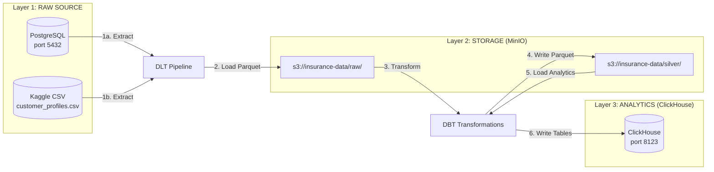
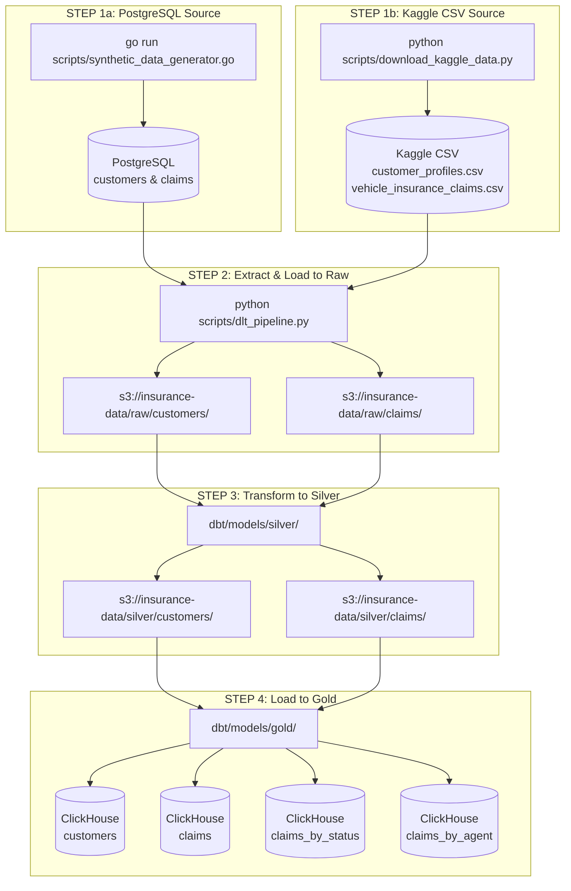
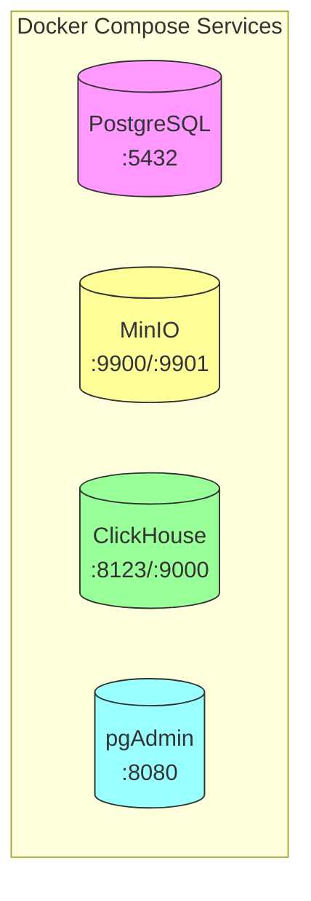
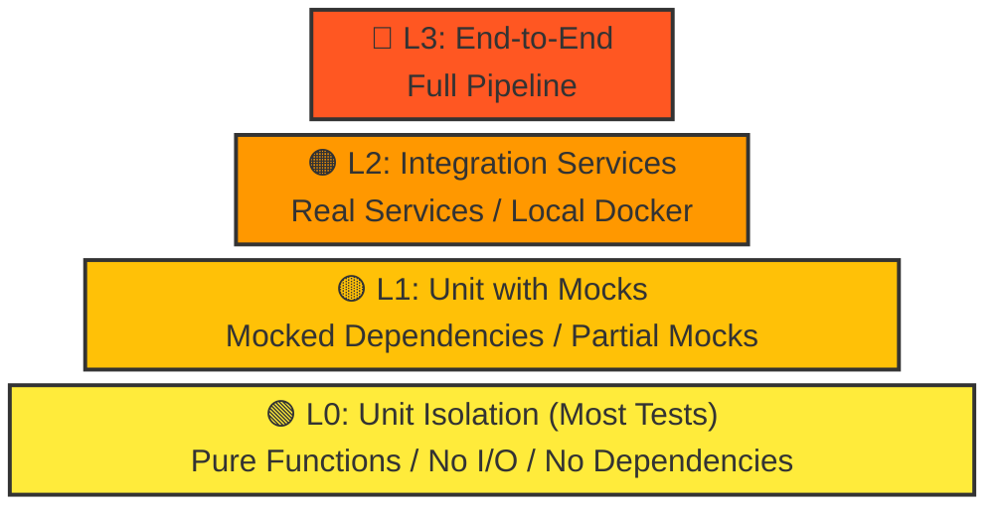

# Insurance Company Data Pipeline

A production-grade data lakehouse pipeline demonstrating modern ELT/ETL architecture with insurance industry data.

<div align="center">

[](https://www.postgresql.org/)
[](https://min.io/)
[](https://clickhouse.com/)
[](https://www.getdbt.com/)
[](https://dlthub.com/)
[](https://www.python.org/)
[](https://go.dev/)
[](https://www.docker.com/)

</div>

---

## Table of Contents

1. [Architecture Overview](#1-architecture-overview)
2. [Data Flow Diagram](#2-data-flow-diagram)
3. [Infrastructure Components](#3-infrastructure-components)
4. [Raw Data Schema](#4-raw-data-schema)
   - [4.1 PostgreSQL Raw Tables](#41-postgresql-raw-tables)
   - [4.2 Kaggle CSV Schema](#42-kaggle-csv-schema)
   - [4.3 Data Mapping](#43-data-mapping)
5. [Project Structure](#5-project-structure)
6. [Test Pyramid](#6-test-pyramid)
7. [Quick Start](#7-quick-start)
8. [Database Connections](#8-database-connections)
9. [Running Tests](#9-running-tests)
10. [SQL Examples](#10-sql-examples)
11. [Environment Variables](#11-environment-variables)
12. [Troubleshooting](#12-troubleshooting)
13. [License](#13-license)
14. [Author](#14-author)

---

```
Copyright (c) 2026 BugMentor (https://bugmentor.com)
Eng. Matías J. Magni | CEO @ BugMentor
```

---

## 1. Architecture Overview

This project implements a **three-tier data lakehouse architecture** with **two raw data sources**:



---

## 2. Data Flow Diagram



**Note:** The pipeline supports **two raw data sources**: PostgreSQL (primary) and Kaggle CSV (alternative). Both feed into the same MinIO raw layer.

---

## 3. Infrastructure Components



| Service | Port | Purpose | Schema |
|---------|------|---------|--------|
| **PostgreSQL** | 5432 | Raw source data | `public.customers`, `public.claims` |
| **MinIO** | 9900 (API), 9901 (Console) | Raw + Silver storage | `s3://insurance-data/{raw,silver}/` |
| **ClickHouse** | 8123 (HTTP), 9000 (Native) | Gold analytics | Table names: `customers`, `claims`, `claims_by_status` |
| **pgAdmin** | 8080 | PostgreSQL admin UI | - |

---

## 4. Raw Data Schema

This section documents the schema of the raw data sources.

### 4.1. PostgreSQL Raw Tables

The PostgreSQL database contains the following tables:

#### customers (Table Schema)

| Column | Type | Description |
|-------|------|-------------|
| `customer_id` | SERIAL | Primary key |
| `first_name` | VARCHAR(100) | Customer first name |
| `last_name` | VARCHAR(100) | Customer last name |
| `email` | VARCHAR(255) | Unique email address |
| `phone_number` | VARCHAR(20) | Phone number |
| `date_of_birth` | DATE | Date of birth |
| `address` | VARCHAR(255) | Street address |
| `city` | VARCHAR(100) | City |
| `state` | VARCHAR(2) | State code (e.g., "NY") |
| `zip_code` | VARCHAR(10) | ZIP code |
| `country` | VARCHAR(100) | Country (default: "USA") |
| `credit_score` | INTEGER | Credit score (500-850) |
| `annual_income` | DECIMAL(12,2) | Annual income |
| `occupation` | VARCHAR(100) | Occupation |
| `created_at` | TIMESTAMP | Creation timestamp |
| `updated_at` | TIMESTAMP | Last update timestamp |

**Sample Row:**
```
customer_id | first_name | last_name | email                     | credit_score | annual_income | occupation
------------|------------|-----------|---------------------------|--------------|---------------|------------------
1           | James      | Smith     | james.smith0@example.com  | 750          | 75000.00      | Software Engineer
```

#### claims (Table Schema)

| Column | Type | Description |
|-------|------|-------------|
| `claim_id` | SERIAL | Primary key |
| `customer_id` | INTEGER | Foreign key to customers |
| `claim_date` | DATE | Date of claim |
| `claim_type` | VARCHAR(50) | Type: Auto, Home, Life, Health, Property |
| `claim_status` | VARCHAR(20) | Status: Open, Closed, Pending, Denied, Investigation |
| `claim_amount` | DECIMAL(12,2) | Claim amount |
| `claim_paid_amount` | DECIMAL(12,2) | Amount paid |
| `vehicle_type` | VARCHAR(20) | Vehicle type: Sedan, SUV, Truck, etc. |
| `agent_id` | INTEGER | Agent ID |
| `agent_name` | VARCHAR(100) | Agent name |
| `created_at` | TIMESTAMP | Creation timestamp |
| `updated_at` | TIMESTAMP | Last update timestamp |

**Sample Row:**
```
claim_id | customer_id | claim_date | claim_type | claim_status | claim_amount | vehicle_type | agent_name
---------|-------------|------------|------------|---------------|--------------|--------------|-------------
1        | 1           | 2024-01-15 | Auto       | Open          | 5000.00      | Sedan        | Agent Smith
```

### 4.2. Kaggle CSV Schema

The Kaggle dataset (`buntystas/vehicle-claims-data`) contains:

#### customer_profiles.csv (Schema)

| Column | Type | Description |
|-------|------|-------------|
| `customer_id` | STRING | Customer ID (e.g., "CUST000001") |
| `name` | STRING | Full name |
| `email` | STRING | Email address |
| `credit_score` | INTEGER | Credit score (500-850) |
| `telematics_score` | INTEGER | Telematics score (0-100) |
| `policy_number` | STRING | Policy number |

**Sample:**
```
customer_id,name,email,credit_score,telematics_score,policy_number
CUST000001,John Smith,john.smith1@email.com,750,85,POL000001
```

#### vehicle_insurance_claims.csv (Schema)

| Column | Type | Description |
|-------|------|-------------|
| `claim_id` | STRING | Claim ID (e.g., "CLM00000001") |
| `policy_number` | STRING | Policy number |
| `claim_date` | DATE | Date of claim |
| `claim_amount` | DECIMAL | Claim amount |
| `claim_type` | STRING | Type: Collision, Comprehensive, Liability, etc. |
| `claim_status` | STRING | Status: Approved, Pending, Rejected, Under Review |
| `vehicle_type` | STRING | Vehicle type |
| `driver_age` | INTEGER | Driver age (18-75) |
| `fraud_indicator` | STRING | Fraud indicator: Y/N |
| `deductible` | INTEGER | Deductible amount |
| `city` | STRING | City |
| `accident_type` | STRING | Accident type |

**Sample:**
```
claim_id,policy_number,claim_date,claim_amount,claim_type,claim_status,vehicle_type,driver_age,fraud_indicator,deductible,city,accident_type
CLM00000001,POL000001,2024-01-15,5000.00,Collision,Approved,Sedan,35,N,500,Los Angeles,Rear-end
```

### 4.3. Data Mapping (PostgreSQL ↔ Kaggle)

| PostgreSQL Field | Kaggle CSV Field | Notes |
|-----------------|------------------|-------|
| `customer_id` | `customer_id` | Different format (INT vs STRING) |
| `first_name + last_name` | `name` | Concatenated in Kaggle |
| `email` | `email` | Same |
| `credit_score` | `credit_score` | Same |
| `claim_id` | `claim_id` | Different format |
| `customer_id` | `policy_number` | References customer |
| `claim_date` | `claim_date` | Same |
| `claim_amount` | `claim_amount` | Same |
| `claim_type` | `claim_type` | Similar (Auto vs Collision) |
| `claim_status` | `claim_status` | Different values |
| `vehicle_type` | `vehicle_type` | Same |
| N/A | `driver_age` | Not in PostgreSQL |
| N/A | `fraud_indicator` | Not in PostgreSQL |

### 4.4. Silver Layer Schema

The **Silver** layer transforms raw data and stores it in MinIO as Parquet files.

#### silver_customers (View Schema)

| Column | Type | Description |
|-------|------|-------------|
| `customer_id` | INTEGER | Primary key |
| `first_name` | VARCHAR(100) | Customer first name |
| `last_name` | VARCHAR(100) | Customer last name |
| `email` | VARCHAR(255) | Email address |
| `phone_number` | VARCHAR(20) | Phone number |
| `date_of_birth` | DATE | Date of birth |
| `address` | VARCHAR(255) | Street address |
| `city` | VARCHAR(100) | City |
| `state` | VARCHAR(2) | State code |
| `zip_code` | VARCHAR(10) | ZIP code |
| `country` | VARCHAR(100) | Country |
| `credit_score` | INTEGER | Credit score (500-850) |
| `annual_income` | DECIMAL(12,2) | Annual income |
| `occupation` | VARCHAR(100) | Occupation |
| `created_at` | TIMESTAMP | Creation timestamp |
| `updated_at` | TIMESTAMP | Last update timestamp |
| **`risk_bucket`** | VARCHAR(20) | NEW: Risk category based on credit score |

**Risk Bucket Logic:**
```
- Excellent: credit_score >= 750
- Good:      credit_score >= 700
- Fair:     credit_score >= 650
- Poor:     credit_score < 650
```

#### silver_claims (View Schema)

| Column | Type | Description |
|-------|------|-------------|
| `claim_id` | INTEGER | Primary key |
| `customer_id` | INTEGER | Foreign key |
| `claim_date` | DATE | Date of claim |
| `claim_type` | VARCHAR(50) | Type: Auto, Home, Life, Health, Property |
| `claim_status` | VARCHAR(20) | Status: Open, Closed, Pending, Denied, Investigation |
| `claim_amount` | DECIMAL(12,2) | Claim amount |
| `claim_paid_amount` | DECIMAL(12,2) | Amount paid |
| `vehicle_type` | VARCHAR(20) | Vehicle type |
| `agent_id` | INTEGER | Agent ID |
| `agent_name` | VARCHAR(100) | Agent name |
| `created_at` | TIMESTAMP | Creation timestamp |
| `updated_at` | TIMESTAMP | Last update timestamp |
| **`claim_status_category`** | VARCHAR(20) | NEW: Simplified status |
| **`vehicle_category`** | VARCHAR(20) | NEW: Vehicle group |

**Status Category Logic:**
```
- Closed:  claim_status = 'Closed'
- Denied:  claim_status = 'Denied'
- Open:    claim_status = 'Open'
- Other:   All other statuses
```

**Vehicle Category Logic:**
```
- Car:        Sedan, Coupe, Wagon
- SUV:         SUV
- Truck:       Truck
- Motorcycle:  Motorcycle
- Other:       All other types
```

### 4.5. Gold Layer Schema

The **Gold** layer contains aggregated analytics tables in ClickHouse (no schema prefix).

#### gold_customers (Table Schema)

Direct copy of `silver_customers` view with all columns.

#### gold_claims (Table Schema)

Direct copy of `silver_claims` view with all columns.

#### gold_claims_by_status (Aggregation)

| Column | Type | Description |
|-------|------|-------------|
| `status` | VARCHAR(20) | Claim status |
| `claim_count` | INTEGER | Count of claims |
| `total_claim_amount` | DECIMAL(12,2) | Sum of all claim amounts |
| `total_paid_amount` | DECIMAL(12,2) | Sum of all paid amounts |
| `avg_claim_amount` | DECIMAL(12,2) | Average claim amount |
| `avg_paid_amount` | DECIMAL(12,2) | Average paid amount |

**Sample:**
```sql
SELECT * FROM claims_by_status;
-- status  | claim_count | total_claim_amount | total_paid_amount
-- Closed   | 2000       | 15000000.00        | 12000000.00
-- Open     | 1500       | 8000000.00         | 0.00
-- Denied   | 500        | 3000000.00         | 0.00
```

#### gold_claims_by_agent (Aggregation)

Aggregated by agent with totals and averages.

#### gold_claims_by_business_line (Aggregation)

Aggregated by vehicle category (Car, SUV, Truck, Motorcycle).

---

## 5. Project Structure

```
insurance-company-data-pipeline-example/
├── docker-compose.yml           # Infrastructure orchestration
├── pipeline.py                  # Main pipeline runner (DLT + DBT)
├── README.md                    # This file
│
├── scripts/                    # Python/Go scripts
│   ├── synthetic_data_generator.go  # Go data generator (1000 customers, 5000 claims) - PostgreSQL ONLY
│   ├── dlt_pipeline.py             # DLT pipeline: PostgreSQL → MinIO raw
│   ├── download_kaggle_data.py     # Download Kaggle insurance dataset
│   └── reset_database.go           # Reset PostgreSQL and regenerate data
│
├── dbt/                        # DBT project
│   ├── dbt_project.yml
│   ├── profiles.yml
│   └── models/
│       ├── sources.yml           # MinIO source definitions
│       ├── silver/
│       │   ├── silver_customers.sql
│       │   └── silver_claims.sql
│       └── gold/
│           ├── gold_customers.sql
│           ├── gold_claims.sql
│           ├── gold_claims_by_status.sql
│           ├── gold_claims_by_agent.sql
│           └── gold_claims_by_business_line.sql
│
├── scripts_unix/                # Unix test runners
│   ├── run_l0_tests.sh          # Unit tests isolated
│   ├── run_l1_tests.sh          # Unit tests integrated
│   ├── run_l2_tests.sh          # Integration tests
│   ├── run_l3_tests.sh          # E2E tests
│   └── run_all_tests.sh         # Run all tests
│
├── scripts_windows/             # Windows test runners
│   ├── run_l0_tests.bat        # Unit tests isolated
│   ├── run_l1_tests.bat        # Unit tests integrated
│   ├── run_l2_tests.bat        # Integration tests
│   ├── run_l3_tests.bat        # E2E tests
│   └── run_all_tests.bat       # Run all tests
│
└── tests/                      # Test suite (77 tests)
    ├── test_L0_unit_isolated.py    # L0: Isolated unit tests (30)
    ├── test_L1_unit_integrated.py  # L1: Integrated unit tests (18)
    ├── test_L2_integration.py     # L2: Integration tests (19)
    └── test_L3_e2e.py           # L3: End-to-end tests (10)
```

---

## 5. Test Pyramid

This project follows the **test pyramid** methodology with four levels of testing:



### 5.1. Test Levels Description

| Level | Name | Description |
|-------|------|-------------|
| **L0** | Unit Isolation | Pure functions, no I/O, no dependencies - most tests |
| **L1** | Unit with Mocks | Mocked dependencies, partial mocks - more tests |
| **L2** | Integration Services | Real services, local Docker - some tests |
| **L3** | End-to-End | Full pipeline - fewest tests |

---

## 7. Quick Start

### 6.1. Start Infrastructure

```bash
docker-compose up -d

# Verify services are running
docker-compose ps
```

### 6.2. Generate Source Data

```bash
# Using Go synthetic data generator (1000 customers, 5000 claims)
go run scripts/synthetic_data_generator.go
```

### 6.3. Reset & Regenerate Database

```bash
# Reset database (truncate all tables)
go run scripts/reset_database.go

# Reset and regenerate data
go run scripts/reset_database.go --regenerate
```

### 6.4. Run Pipeline

```bash
# Run full pipeline: PostgreSQL → MinIO (raw) → MinIO (silver) → ClickHouse (gold)
python pipeline.py

# Or run steps individually:
python scripts/dlt_pipeline.py       # PostgreSQL → MinIO raw
cd dbt && dbt run                  # MinIO raw → MinIO silver → ClickHouse gold
```

---

## 8. Database Connections

### 7.1. PostgreSQL (Raw Source)

| Parameter | Value |
|-----------|-------|
| Host | localhost |
| Port | **5432** |
| Database | insurance_db |
| Username | insurance_user |
| Password | insurance_pass |

**Tables:**
- `public.customers` - Customer profiles (1,000 rows)
- `public.claims` - Insurance claims (5,000 rows)

### 7.2. MinIO (Raw + Silver Layers)

| Parameter | Value |
|-----------|-------|
| Host | localhost |
| Port | **9900** (API) |
| Console | http://localhost:9901 |
| Bucket | insurance-data |
| Access Key | minioadmin |
| Secret Key | minioadmin |

**Path Structure:**
```
s3://insurance-data/
├── raw/
│   ├── customers/
│   │   └── customers_001.parquet
│   └── claims/
│       └── claims_001.parquet
└── silver/
    ├── customers/
    │   └── customers_enriched.parquet
    └── claims/
        └── claims_with_agents.parquet
```

### 7.3. ClickHouse (Gold Layer)

| Parameter | Value |
|-----------|-------|
| Host | localhost |
| Port | **8123** (HTTP) or 9000 (Native) |
| Database | insurance_db |
| Username | default |
| Password | clickhouse_pass |

**Gold Tables (NO schema prefix - just table names):**
- `customers` - Enriched customer data with risk buckets
- `claims` - Claims with agent group assignments
- `claims_by_status` - Aggregated by claim status
- `claims_by_agent` - Aggregated by agent group
- `claims_by_business_line` - Aggregated by vehicle type

---

## 9. Running Tests

### 8.1. Unix/Linux/macOS

```bash
# Run all tests
./scripts_unix/run_all_tests.sh

# Run specific test levels
./scripts_unix/run_l0_tests.sh   # Unit tests - isolated
./scripts_unix/run_l1_tests.sh   # Unit tests - integrated
./scripts_unix/run_l2_tests.sh  # Integration tests
./scripts_unix/run_l3_tests.sh  # End-to-end tests
```

### 8.2. Windows

```cmd
REM Run all tests
scripts_windows\run_all_tests.bat

REM Run specific test levels
scripts_windows\run_l0_tests.bat   -- Unit tests - isolated
scripts_windows\run_l1_tests.bat   -- Unit tests - integrated
scripts_windows\run_l2_tests.bat  -- Integration tests
scripts_windows\run_l3_tests.bat   -- End-to-end tests
```

### 8.3. Direct pytest

```bash
# Run all tests
pytest tests/ -v

# Run specific test file
pytest tests/test_L0_unit_isolated.py -v
pytest tests/test_L1_unit_integrated.py -v
pytest tests/test_L2_integration.py -v
pytest tests/test_L3_e2e.py -v
```

---

## 10. SQL Examples

### 10.1. ClickHouse Gold Layer

All tables in ClickHouse are accessed **without** schema prefix:

```sql
-- View all customers
SELECT * FROM customers LIMIT 10;

-- View all claims
SELECT * FROM claims LIMIT 10;

-- Claims by status
SELECT * FROM claims_by_status;

-- Claims by agent
SELECT * FROM claims_by_agent;

-- Claims by business line (vehicle type)
SELECT * FROM claims_by_business_line;

-- Analytics: Open vs Closed claims
SELECT 
    claim_status,
    COUNT(*) AS claim_count,
    SUM(claim_paid_amount) AS total_paid
FROM claims
GROUP BY claim_status;

-- Customer risk analysis
SELECT 
    risk_bucket,
    COUNT(*) AS customer_count,
    AVG(credit_score) AS avg_credit_score
FROM customers
GROUP BY risk_bucket
ORDER BY customer_count DESC;
```

---

## 11. Environment Variables

Create a `.env` file in the project root:

```bash
# PostgreSQL
POSTGRES_USER=insurance_user
POSTGRES_PASSWORD=insurance_pass
POSTGRES_DB=insurance_db

# MinIO
MINIO_ROOT_USER=minioadmin
MINIO_ROOT_PASSWORD=minioadmin
MINIO_BUCKET=insurance-data

# ClickHouse
CLICKHOUSE_DB=insurance_db
CLICKHOUSE_USER=default
CLICKHOUSE_PASSWORD=clickhouse_pass
```

---

## 12. Troubleshooting

### 12.1. Check MinIO Console

1. Open http://localhost:9901 in browser
2. Login with: minioadmin / minioadmin
3. Verify bucket `insurance-data` exists with `raw/` and `silver/` folders

### 11.2. Check ClickHouse

```bash
# Using clickhouse-client
docker exec -it insurance_clickhouse clickhouse-client

# Check tables
SHOW TABLES;

-- Should show: customers, claims, claims_by_status, claims_by_agent, claims_by_business_line
```

### 11.3. Check PostgreSQL

```bash
# Connect to PostgreSQL
docker exec -it insurance_postgres psql -U insurance_user -d insurance_db

-- Check tables
/dt

-- Should show: customers, claims
```

---

## 13. License

Copyright (c) 2026 BugMentor (https://bugmentor.com)

---

## 14. Author

**Eng. Matías J. Magni**  
CEO @ BugMentor  
https://bugmentor.com